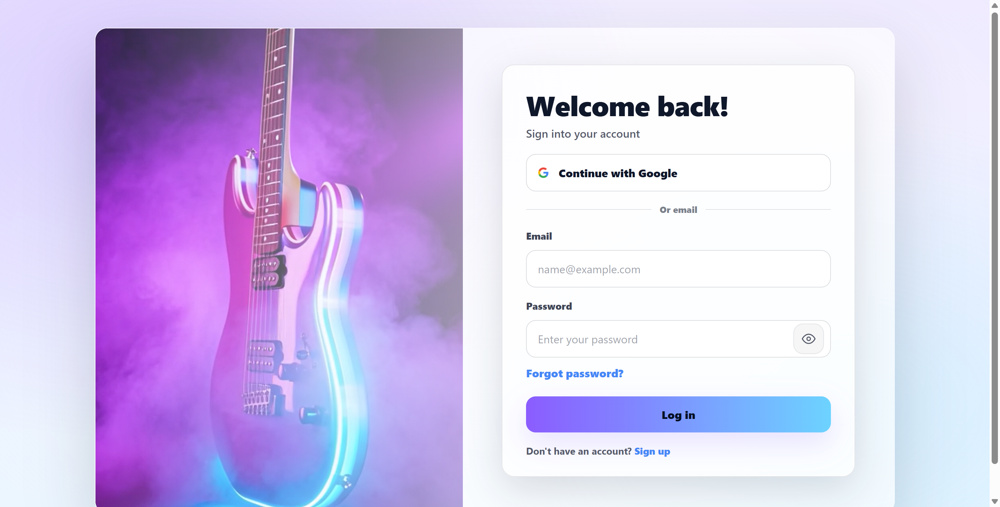
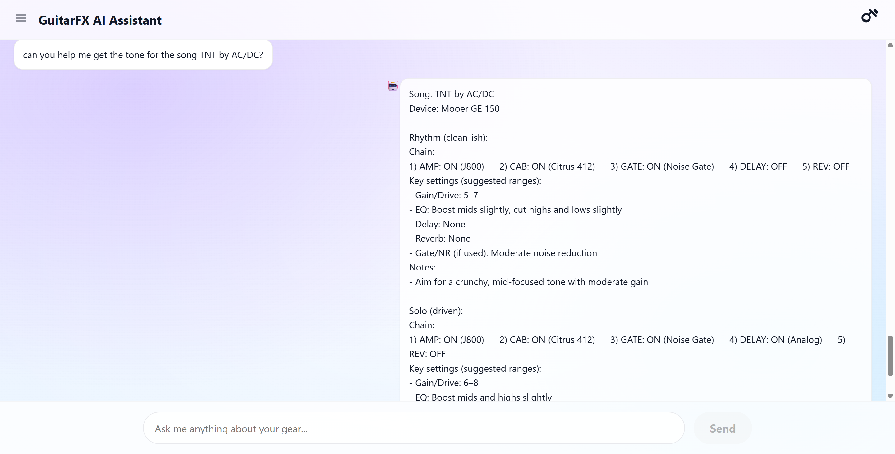
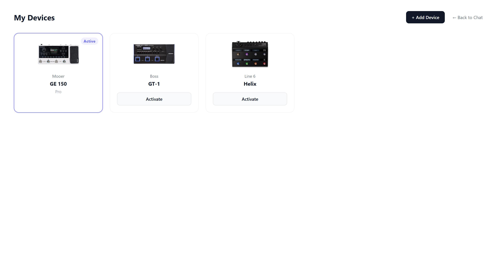

# GuitarAmpAgent

An AI assistant for guitar multi-effects processors. Point it at a device, ask a
question, and get an answer grounded in that device's actual manual instead of general
guitar knowledge.

**Live demo: [guitareagent.com](https://guitareagent.com)**

Sign up with any email, enter the verification code, pick a device, and start asking.
Three devices are loaded: Mooer GE150 Pro, Boss GT-1, and Line 6 HX Effects.

> **This is a demo, not a product.** It runs on my own API credits, so each account is
> limited to 10 questions per day. Manual uploads are disabled in the deployed version.



---

## The problem

Multi-effects processors ship with hundreds of amp models, cabs, and effect blocks,
documented across several PDFs that are hard to search and harder to turn into "what do I
actually switch on to sound like this song."

General-purpose chat models answer these questions fluently and often wrongly. Ask one
for an AC/DC tone on a Mooer GE150 and it suggests a JTM45. That is a real Marshall amp
and a reasonable choice for the sound, but not something that exists on that pedal. The
answer reads as authoritative and is useless in front of the actual device.

---

## What it does

**Answers questions from the device's own manual.** One device can have several manuals.
The Boss GT-1 ships an owner's manual, a parameter guide, and an editor manual, and the
effect tables only exist in one of them. Retrieval covers all of them.

**Builds tone recipes for songs.** Which modules to switch on, which model to pick for
each, and rough parameter ranges, split into a rhythm and a lead setting.



**Manages multiple devices.** Bind several, switch the active one, and the knowledge base
and module allow-lists switch with it.



**Saves setups** to a song library, with the device they were built for.

---

## How it works

### Ingestion happens at upload time

All the expensive work is done once, when a manual is added through the admin page, not
per question. The PDF gets chunked and embedded, then a second model pass reads it and
pulls out structured rows: one per effect module, plus MIDI mappings where the device
supports them. Those rows are what later constrains the chat model's answers.

The upload form also carries a few device capability flags. The MIDI one gates whether
the MIDI extraction pass runs at all, so a device with no MIDI port doesn't burn model
calls looking for CC tables that don't exist.

Admin routes are enabled locally and excluded from the deployed build.

### Models

`deepseek-v3` through Alibaba DashScope's OpenAI-compatible endpoint handles chat, tone
recipes, and extraction. Qwen embeddings handle document and query vectors.

### Chunking

Chunk size is picked per document, not fixed globally. A parameter guide is dense tables
where small chunks keep related rows together. A Line 6 manual groups effects into long
category sections where cutting too finely separates a model name from its description.

| Profile | Size | Used for |
|---|---|---|
| `BOSS_FINE` | 450 tokens | Boss parameter guides, dense tables |
| `HELIX_COARSE` | larger | Line 6 manuals, long grouped sections |
| `DEFAULT_MED` | 800 tokens | Everything else |

Selection is by document type first, brand as fallback, then a safe default.

### Extraction strategies

Each brand gets a strategy class deciding which pages are worth sending to the model,
what the prompt says, and how to normalize what comes back.

| Strategy | Effects | MIDI |
|---|---|---|
| Mooer GE | Tables of model name plus "based on" description | Not supported |
| Boss GT | Preamp and effect lists across multiple manuals | Not supported |
| Line 6 HX | Category-grouped blocks, chunk-ref linking | Supported |
| Generic | Fallback for unrecognized brands | Not supported |

Brand routing uses the upload form hint first, then the device name, then the manual text
itself. The fallbacks matter: a typo in the brand field would otherwise drop a device to
the generic strategy and quietly degrade every answer about it.

### Query routing

Questions are routed before any model is called. Keyword-based, not an LLM classifier,
which keeps it free and deterministic.

| Route | Goes to |
|---|---|
| `INVENTORY` | Direct database query, no model call |
| `TONE_RECIPE` | Structured recipe against the device's module allow-lists |
| `MANUAL_QA` / `OTHER` | Retrieval-augmented agent over the manual |

Tone recipes require two independent signals: a song reference and a tone or setup
intent. An earlier version let a single word like "settings" trigger the route alone,
which turned "what is a preset?" into a tone recipe with the question itself in the song
field.

The tradeoff is that phrasings outside the keyword tables fall through to the general
agent. That is the intended failure direction: a slightly generic answer rather than a
confidently wrong structured one.

### Retrieval

Chunks live in Postgres with pgvector, searched by cosine distance and scoped to all
public knowledge sources belonging to the active device.

Scoping is by **device**, not by document. Scoping by document was the original design and
it broke quietly on any device with more than one manual, since the active source was
whichever one the user last activated rather than the one holding the answer.

Tone recipes deliberately **do not** put the song name in the retrieval query. The manual
has nothing to say about any particular song. The query is built from the device name and
a fixed hint about amps, cabs, and effect blocks, so retrieval returns device constraints
and the song only shapes generation.

---

## Keeping the model inside the device's reality

The hard problem was not retrieval quality. It was that the model already knows a great
deal about guitar amps and will use that knowledge instead of the manual.

Manual chunks alone don't fix this. Whether the right module list lands in the retrieved
text is partly luck, and even when it does, nothing forces the model to use it.

Two layers:

**Retrieval side.** Module names for a category are queried directly from the extracted
rows, scoped by device, and passed into the prompt as an explicit allow-list. Structured
data, not text matched out of a snippet, so the list is complete and exact.

**Enforcement side.** After the JSON response is parsed, a deterministic pass walks the
signal chain and nulls out any module name not on the allow-list. It also drops a chain
line entirely when the device has no modules in that category, which is why an
effects-only unit like the HX Effects doesn't render an empty amp slot it never had.

The second layer exists because the first only asks. Prompt instructions are followed
most of the time, and the gap between "most of the time" and "always" is visible to
anyone trying the demo.

One thing this surfaced: `raw_type` is not a fixed enum. It is whatever the model wrote
while reading a given brand's manual, so delay is `DLY` on Boss and `DELAY` on the other
two, and every real noise gate ended up filed under `DYNAMICS` next to the compressors.
Category lookups pass a set of known spellings, and the gate list gets a second filter on
the module name so it stops handing back a compressor.

---

## Evaluation

A RAGAS-based endpoint replays questions through the full chat pipeline, collects
retrieved contexts, and scores answers with a judge model. Admin-only, disabled in the
demo. It has been a spot-check tool for retrieval changes rather than a continuous
benchmark. Turning it into a regression suite with a fixed question set is the obvious
next step.

---

## Usage limits

**Per account, per day:** 10 chat queries plus a token ceiling. Both counters live on the
user row and reset lazily on the first request of a new day rather than through a
scheduled job. The date check, reset, limit check, and increment happen in one atomic
`UPDATE`, so concurrent requests cannot slip past the cap. A query that fails before
producing an answer refunds its slot.

**Signup:** rate limited per IP, on top of a per-address resend cooldown. Without the IP
limit, switching email addresses bypasses the cooldown and every send costs mail quota.

Admin routes are excluded from the deployed build entirely rather than left up behind a
token, since a token check that fails open is worse than no admin surface at all.

---

## Stack

React and TypeScript on the front. FastAPI with a LangGraph tool-calling agent on the
back. PostgreSQL 16 with pgvector. JWT auth with Google OAuth and email verification
through Resend. Docker Compose locally, Railway and Cloudflare for the demo.

---

## Running locally

```bash
docker compose up -d db          # database only, backend runs on the host

cd backend
pip install -r requirements.txt
uvicorn app.main:app --reload --port 8000

cd frontend
npm install
npm run dev
```

App comes up at `http://localhost:5173`, with admin routes enabled so you can add
devices. Two `.env` files are needed: one at the repo root for Docker Compose, one under
`backend/` for the application. See `frontend/.env.example` for the frontend variable.

---

## Known gaps

- Query routing is keyword-based and will miss phrasings outside its tables
- Only amp and cab names get the deterministic post-parse check. Delay, reverb, and gate
  are constrained by prompt only
- Cross-brand `raw_type` normalization was designed but not built, so category lookups
  carry per-brand synonym sets instead
- The evaluation endpoint is a spot-check tool, not a regression suite
- No automated tests

---

## License

Portfolio project. All rights reserved.
